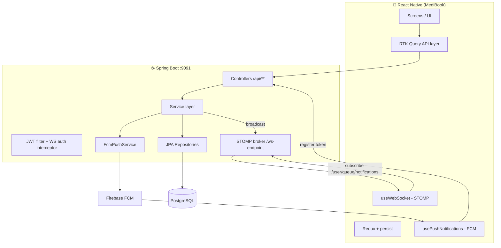

# MediBook — Architecture & Improvement Roadmap

> A full‑stack doctor‑appointment platform: a **Spring Boot** backend (`doc-appointment`) and a
> **React Native** mobile app (`doc-appoint-mobileApp`, app name *MediBook*).
> This document is a deep‑dive reference for understanding the system and planning improvements/new features.
> It complements [`system_flow.md`](./system_flow.md) (which holds the high‑level Mermaid flow diagrams).

---

## 1. Overview

MediBook lets **patients** discover doctors, book appointment slots, exchange medical documents, and review
doctors; and lets **doctors** manage availability slots, accept/track appointments, write clinical notes, and
reply to reviews. Real‑time updates flow over STOMP WebSocket when the app is in the foreground and over
Firebase Cloud Messaging (FCM) push when it's backgrounded.

There are exactly **two roles** — `PATIENT` and `DOCTOR` — stored in separate tables. There is **no admin role**
and no web frontend; the mobile app is the only client.

### Repository layout & how the two sides connect

| Repo (local path) | Role | Runtime |
|---|---|---|
| `doc-appointment/` | Backend (this repo) | Spring Boot, listens on **:9091** |
| `doc-appoint-mobileApp/` | Mobile client | React Native 0.73 (Android‑first) |

The mobile app talks to the backend at a **hardcoded LAN IP**:

- REST base URL — `http://192.168.5.92:9091/api/` ([`src/services/api.ts:6`](../doc-appoint-mobileApp/src/services/api.ts))
- WebSocket — `ws://192.168.5.92:9091/ws-endpoint` (`src/hooks/useWebSocket.ts`)

> ⚠️ This IP must be changed to match the developer's machine (or externalized) before the app can reach the
> backend. See [§9 Roadmap](#9-improvement--new-feature-roadmap).

---

## 2. Tech stack

| Layer | Backend | Mobile |
|---|---|---|
| Language / runtime | Java 17 | TypeScript, React Native 0.73.6 |
| Framework | Spring Boot 3.5.10 | React 18.2 |
| Security | Spring Security + JWT (JJWT 0.12.6), BCrypt | JWT stored in Redux (encrypted persist) |
| Data | Spring Data JPA / Hibernate, PostgreSQL 14 | Redux Toolkit + **RTK Query** (API cache) |
| State / persistence | — | redux‑persist over `react-native-encrypted-storage` |
| Navigation | — | React Navigation v6 (native‑stack + bottom‑tabs) |
| Forms / validation | Jakarta Validation | react‑hook‑form + Zod |
| Real‑time | Spring WebSocket (STOMP), `SimpMessagingTemplate` | `@stomp/stompjs` |
| Push | Firebase Admin SDK 9.2.0 | `@react-native-firebase/messaging` |
| Files | Local disk, AES‑256 encrypted (`CryptoUtils`) | `react-native-blob-util`, `react-native-document-picker` |
| API docs | SpringDoc / Swagger UI (`/swagger-ui.html`) | — |
| Styling | — | NativeWind (Tailwind) + `lucide-react-native` |
| Build | Maven (`./mvnw`) | Metro / Gradle |

---

## 3. System architecture

> Note: `system_flow.md` labels the WS endpoint `/ws`; the actual registered endpoint is **`/ws-endpoint`**
> (`config/WebSocketConfig.java:30`).

---

## 4. Backend deep‑dive (`com.clinic.doc_appointment`)

Standard layered Spring Boot app: `controller → service → repository → entity`, with `dto/request`,
`dto/response`, `enums`, `exception`, `security`, `config`, `specification`, and `util` packages.

### 4.1 Domain model (entities)

| Entity | PK (prefix) | Key fields | Relationships | Notes |
|---|---|---|---|---|
| `Doctor` | `DOC-` | name, email (unique), countryCode+phone (unique), password (BCrypt), `specialization`, qualification, experienceYears, `consultationFee`, about, **averageRating**, **totalReviews**, isActive | 1‑N `DoctorAvailability`, 1‑N `Appointment` | rating/review counts are **denormalized** (updated by `ReviewService`) |
| `Patient` | `PAT-` | name, email (unique, **optional**), countryCode+phone (unique), password, gender, dateOfBirth, address | 1‑N `Appointment` | email optional → see gap in §8 |
| `DoctorAvailability` (slot) | `SLOT-` | slotDate, startTime, endTime, durationMinutes, isAvailable, **`@Version` version** | N‑1 `Doctor`, 1‑1 `Appointment` | **optimistic locking** here prevents double‑booking |
| `Appointment` | `APPOINTMENT-` | `appointmentNumber` (unique), `status`, reasonForVisit, `notes` (TEXT), **`@Version` version** | N‑1 `Patient`, N‑1 `Doctor`, 1‑1 slot, 1‑1 `Payment` | slot freed inline in `AppointmentService.cancelAppointment`; **optimistic locking** via `@Version` |
| `Payment` | `PAYMENT-` | amount, paymentMethod, transactionId, status (PENDING default) | 1‑1 `Appointment` | **entity only — never created** (see §8) |
| `Review` | `REVIEW-` | appointmentId (unique), rating (1–5), comment, doctorReply, repliedAt | 1‑1 `Appointment`, N‑1 `Doctor`, N‑1 `Patient` | one review per appointment; rating not DB‑constrained |
| `Notification` | UUID | userId (patient *or* doctor), title, message, `type`, relatedEntityId, isRead | — (polymorphic `userId` string) | indexed on `(user_id, is_read)` |
| `UserDevice` | UUID | userId, fcmToken (unique), deviceType, isActive | — | supports multiple devices; old tokens deactivated |
| `AppointmentDocument` | `DOC-` | appointmentId, uploaderId, uploaderRole, fileName, fileUrl (encrypted path), fileType, documentType, fileSize | N‑1 `Appointment` (LAZY) | files stored AES‑256 encrypted on disk |

Slot freeing on cancel: `AppointmentService.cancelAppointment` sets the slot's `isAvailable=true`
inline, in the same `@Transactional` (+`@Retryable`) unit as the status change to `CANCELLED` —
mirroring how booking reserves the slot. (This replaced a fragile `AppointmentEntityListener` that
relied on a `static @Autowired` repository.)

### 4.2 Enums

| Enum | Values |
|---|---|
| `AppointmentStatus` | `PENDING`, `CONFIRMED`, `CANCELLED`, `COMPLETED`, `NO_SHOW` |
| `NotificationType` | `APPOINTMENT_UPDATE`, `GENERAL_ALERT`, `PROMOTIONAL` |
| `Specialization` | 20 values incl. `GENERAL_PRACTITIONER`, `CARDIOLOGIST`, `DERMATOLOGIST`, `PEDIATRICIAN`, `ORTHOPEDIC_SURGEON`, … `DENTIST`, `PHYSIOTHERAPIST` (each carries a display name) |
| `Gender` | `MALE`, `FEMALE`, `OTHER` |
| `PaymentMethod` | `CARD`, `UPI`, `NET_BANKING`, `CASH`, `WALLET` |
| `PaymentStatus` | `PENDING`, `COMPLETED`, `FAILED`, `REFUNDED` |

### 4.3 API catalog

All under `/api`. ✅ = implemented & wired.

**Auth** — `/api/auth` (public)
| Method | Path | Purpose |
|---|---|---|
| POST | `/doctor/register` | register doctor → JWT |
| POST | `/doctor/login` | doctor login → JWT |
| POST | `/patient/register` | register patient → JWT |
| POST | `/patient/login` | patient login → JWT |

**Appointments** — `/api/appointments`
| Method | Path | Purpose |
|---|---|---|
| POST | `/book` | book (optimistic‑lock + `@Retryable` ×3) |
| GET | `/{appointmentId}` | get by ID (used for notification deep‑links) |
| GET | `/number/{appointmentNumber}` | get by reference number |
| GET | `/patient/{patientId}` `/patient/{patientId}/upcoming` | patient's appointments |
| GET | `/doctor/{doctorId}` `/doctor/{doctorId}/upcoming` `/doctor/{doctorId}/date/{date}` | doctor's appointments |
| PUT | `/{id}/confirm` `/cancel` `/complete` `/no-show` | status transitions |
| PUT | `/{id}/notes` | doctor adds/updates clinical notes |

**Slots** — `/api/slots`
| Method | Path | Purpose |
|---|---|---|
| POST | `/` `/bulk` | create one / auto‑generate many (start→end, duration + break) |
| GET | `/{slotId}` `/doctor/{id}` `/doctor/{id}/date/{date}` `/doctor/{id}/range` `/doctor/{id}/date/{date}/all` | various reads (available vs all) |
| DELETE | `/{slotId}` `/doctor/{id}/date/{date}` | delete one / by date (fails if booked) |

**Doctors** — `/api/doctors`
| Method | Path | Purpose |
|---|---|---|
| POST | `/register` | (also exposed via `/auth`) |
| GET | `/` | all active doctors |
| GET | `/search` | dynamic filter (name, specialization, fee range, experience, rating, availableOnly) via `DoctorSpecification` |
| GET | `/{id}` · `/specializations` · `/specialization/{spec}` · `/available/specialization/{spec}` | reads |
| PUT | `/{id}` | update profile (JPQL update to avoid cascade issues) |

**Patients** — `/api/patients`: POST `/register`, GET `/{id}` · `/phone` · `/`, PUT `/{id}`, DELETE `/{id}`.

**Reviews** — `/api/reviews`: POST `/` (`hasRole('PATIENT')`), POST `/{reviewId}/reply` (`hasRole('DOCTOR')`),
GET `/doctor/{doctorId}?sort=recent|high|low&page&size` (public).

**Notifications** — `/api/notifications` (all `isAuthenticated()`): GET `/`, POST `/device-token`,
GET `/unread-count`, PUT `/{id}/read`, PUT `/read-all`. User identity comes from the JWT principal, not a path param.

**Documents** — `/api`: POST `/appointments/{id}/documents` (multipart), GET `/appointments/{id}/documents`,
GET `/documents/{documentId}/download` (streams decrypted), DELETE `/documents/{documentId}`. Access is
restricted to appointment participants; only the uploader or the doctor can delete.

**Payments** — `/api/payments`: **empty stub class, no endpoints.**

`RootController` redirects `/` → Swagger UI. All responses are wrapped in `ApiResponse<T>` (success flag,
message, data, timestamp). `GlobalExceptionHandler` maps the rich exception hierarchy
(`ResourceNotFoundException`, `SlotAlreadyBookedException`, `BookingConflictException`, `InvalidStateException`,
`DuplicateResourceException`, slot/date/time validation, …) to proper HTTP statuses.

### 4.4 Security

- **`SecurityConfig`** — stateless, CSRF off, JWT filter before `UsernamePasswordAuthenticationFilter`.
  Public URLs: `/`, `/api/auth/**`, Swagger, `/v3/api-docs/**`, `/ws-endpoint/**`. Everything else requires a token.
  **CORS allows all origins (`*`)** — fine for a mobile API, risky if a browser client is ever added.
- **`JwtService`** — HS256, 24 h expiry, claims carry `role` + `userId`; secret read from `jwt.secret`.
- **`JwtAuthFilter`** — extracts Bearer token, loads `UserPrincipal` via `CustomUserDetailsService`
  (checks doctors table, then patients).
- **`WebSocketAuthInterceptor`** — authenticates the STOMP `CONNECT` frame using the same Bearer token, so
  `/user/queue/...` destinations resolve per user.

### 4.5 Real‑time & file storage

- **WebSocket** (`WebSocketConfig`): broker prefixes `/topic` + `/queue`, app prefix `/app`, user prefix `/user`.
  The app subscribes to `/user/queue/notifications`; `NotificationService` pushes there via `SimpMessagingTemplate`.
- **FCM** (`FcmPushService`): sends high‑priority pushes to a user's registered tokens; deactivates a token if
  Firebase reports it `UNREGISTERED`; **silently no‑ops if Firebase isn't initialized** (so notifications still
  persist in the DB but no push is delivered).
- **Files** (`LocalFileStorageServiceImpl`): encrypts on write / decrypts on read with AES‑256 using
  `file.encryption.secret`; stores under the `uploads/` dir.

### 4.6 Seed data (`DataSeeder`)

Runs once on startup only if `doctors` table is empty. Creates **5 doctors + 5 patients** (all password
`password123`), a spread of slots (15/30/60‑min) across −2…+2 days, and **10 appointments** covering every status.
Sample logins:

- Doctor: `anjali.sharma@clinic.com` (Cardiologist), `rahul.verma@clinic.com` (Dermatologist), … / `password123`
- Patient: `priya.mehta@gmail.com`, `amit.singh@gmail.com`, … / `password123`

---

## 5. Mobile deep‑dive (`doc-appoint-mobileApp/src`)

### 5.1 Navigation graph

`App.tsx` → `RootNavigator` decides the tree by `auth.isAuthenticated` + `auth.role`:

- **Unauthenticated** → `AuthStack`: `Splash → Login → Register → OTPVerification`.
- **Authenticated PATIENT** → `PatientTabNavigator`: **Home · Search · Appointments(Schedule) · Profile**.
- **Authenticated DOCTOR** → `DoctorTabNavigator`: **Dashboard · Schedule · Patients(Appointments) · Profile**.
- **Modals (both roles)**: `BookingModal`, `DoctorProfile`, `EditPatientProfile`, `EditDoctorProfile`,
  `DoctorAppointmentDetails`, `PatientAppointmentDetails`, `Notifications`.
- A **`GlobalServices`** component boots the WS + push hooks; a **`SessionGuard`** watches `auth.sessionExpired`
  (set by the global 401 handler) and force‑logs‑out with a navigation reset.

### 5.2 State

Only the **`auth`** slice is persisted (encrypted). Slices:
- `authSlice` — `{ user, token, role, isAuthenticated, sessionExpired }`; actions `setCredentials`, `logout`,
  `setRole` (defined but never dispatched), `markSessionExpired`.
- `appointmentSlice` — appointment list + booking form draft (date/time/type/notes).
- `doctorSlice` — doctors + selectedDoctor (**largely unused**; screens read RTK Query directly).
- **RTK Query** (`services/api.ts`) is the real data layer — ~40 endpoints with tag‑based cache invalidation
  (`User, Doctor, Appointment, Slot, Notification, Review, Document`) and a global 401 → logout interceptor.

### 5.3 Screen inventory

| Group | Screen | Does | Main hooks |
|---|---|---|---|
| Auth | `LoginScreen` | role‑toggle login | `usePatientLoginMutation`, `useDoctorLoginMutation` |
| Auth | `RegisterScreen` | patient/doctor register, country‑code picker | `use{Patient,Doctor}RegisterMutation` |
| Auth | `OTPVerificationScreen` | 4‑digit OTP UI — **mocked, not wired** | none |
| Patient | `HomeScreen` | specialization chips, search, upcoming, filter sheet | `useGetSpecializationsQuery`, `useSearchDoctorsQuery`, `useGetUpcomingPatientAppointmentsQuery`, `useGetUnreadNotificationCountQuery` |
| Patient | `PatientScheduleScreen` | appointment list + status badges | `useGetPatientAppointmentsQuery` |
| Patient | `PatientDoctorProfileScreen` | doctor detail + sortable reviews | `useGetDoctorByIdQuery`, `useGetDoctorReviewsQuery` |
| Patient | `AppointmentBookingScreen` | pick date/slot, reason, **payment method (mocked, ₹2 hardcoded)** | `useGetDoctorByIdQuery`, `useGetDoctorSlotsQuery`, `useCreateAppointmentMutation` |
| Patient | `PatientAppointmentDetailsScreen` | detail, cancel, review, documents | `useGetAppointmentByIdQuery`, `useCancelAppointmentMutation`, `useSubmitReviewMutation`, `useUploadAppointmentDocumentMutation` |
| Patient | `PatientProfileScreen` / `EditPatientProfileScreen` | view / edit profile | `useGetPatientProfileQuery`, `useUpdatePatientMutation` |
| Doctor | `DoctorDashboardScreen` | today + upcoming + slot summary + actions | date/upcoming appointment queries, status mutations |
| Doctor | `DoctorScheduleScreen` | create/bulk‑create/delete slots | slot queries + `useCreate{,Bulk}SlotMutation`, delete mutations |
| Doctor | `DoctorAppointmentsScreen` | tabbed list, search, action sheet | `useGetDoctorAppointmentsQuery`, confirm/complete/cancel/no‑show |
| Doctor | `DoctorAppointmentDetailsScreen` | patient info + history, notes editor, review reply, docs | `useGetAppointmentByIdQuery`, `useUpdateAppointmentNotesMutation`, `useReplyToReviewMutation` |
| Doctor | `DoctorProfileScreen` / `EditDoctorProfileScreen` | view / edit profile | `useGetDoctorProfileQuery`, `useUpdateDoctorMutation` |
| Common | `NotificationsScreen` | paginated list, mark read; **deep‑link nav commented out** | `useGetNotificationsQuery`, mark‑read mutations |

### 5.4 Real‑time hooks

- `useWebSocket.ts` — STOMP client to `ws://192.168.5.92:9091/ws-endpoint` with Bearer auth, 4 s heartbeats,
  5 s reconnect, foreground‑reconnect on app resume; on message → Toast + invalidate `Notification`/`Appointment` tags.
- `usePushNotifications.ts` — requests `POST_NOTIFICATIONS` on Android 13+, gets the FCM token, registers it via
  `POST /notifications/device-token`, re‑registers on token refresh, and routes taps (foreground/background/quit)
  to the right appointment‑detail screen via `relatedEntityId`.

### 5.5 Theme & utils

Manrope type scale, blue `#186be7` primary (`theme/`); `utils/` has Zod schemas (`validation.ts`), date/time
formatters, an encrypted‑storage wrapper, and a single `STATUS_CONFIG` source for appointment status badges.

---

## 6. Key flows

- **Auth** — login/register → JWT + user info into Redux (persisted) → role decides the tab tree. Every request
  attaches `Authorization: Bearer <jwt>`; a 401 anywhere triggers global logout.
- **Booking** — patient picks slot → `POST /appointments/book {patientId, slotId, reason, notes}` → server validates
  slot availability, marks it unavailable (optimistic lock; retries on conflict), creates `PENDING` appointment,
  and notifies **both** parties (DB + WS + FCM).
- **Lifecycle** — doctor `confirm`/`complete`/`no-show`; either party `cancel`. Cancel auto‑frees the slot via the
  entity listener. Each transition is state‑validated and fires a notification.
- **Notifications** — `NotificationService.sendNotification(...)` persists a row, pushes to `/user/queue/notifications`
  (foreground bell/toast), and sends FCM (background drawer).
- **Documents** — multipart upload → AES‑256 encrypted on disk → metadata row; download streams decrypted bytes
  with access control.

---

## 7. Current‑state matrix

| Capability | Backend | Mobile | Status |
|---|---|---|---|
| Auth (login/register, JWT) | ✅ | ✅ | Complete |
| Doctor discovery + filtered search | ✅ | ✅ | Complete |
| Slot management (single + bulk) | ✅ | ✅ | Complete |
| Booking + lifecycle + concurrency | ✅ | ✅ | Complete |
| Clinical notes | ✅ | ✅ | Complete |
| Reviews + doctor replies + rating rollup | ✅ | ✅ | Complete |
| Encrypted document exchange | ✅ | ✅ | Complete |
| Notifications (WS + FCM + token lifecycle) | ✅ | ✅ | Complete (FCM needs Firebase creds) |
| **Payments** | ❌ empty stub | ⚠️ mocked picker, ₹2 hardcoded, not sent | **Not implemented** |
| **OTP verification** | ❌ no endpoint | ⚠️ UI only, mocked, not wired | **Not implemented** |
| **Forgot / reset password** | ❌ | ⚠️ dead link | **Not implemented** |
| **Patient Search tab** | n/a | ⚠️ placeholder `<View>` | **Stub** |
| **Notification deep‑link nav** | n/a | ⚠️ commented out | **Half‑built** |
| **Admin role / console** | ❌ | ❌ | **Absent** |

---

## 8. Gaps, risks & smells

**Security / config**
1. **Secrets committed in `application.yaml`** — `jwt.secret` and `file.encryption.secret` are hardcoded.
   Externalize to env vars / a vault; never log them.
2. **Hardcoded LAN IP** in `api.ts` and `useWebSocket.ts` — blocks any environment switch; should be config‑driven.
3. **CORS `*`** — acceptable for a pure mobile API; tighten if a browser client is added.
4. **No document type/size validation** beyond Spring's 10 MB multipart limit, and no malware scan.

**Data integrity / concurrency**
5. **`Appointment` has no `@Version`** — concurrent edits (notes/status) can silently clobber. Slots are protected;
   appointments aren't.
6. **Review `rating` not constrained 1–5** at the DB or bean‑validation level.
7. **Patient email optional but used as login username** — a patient registered without an email can't log in by email.
8. **No timezone strategy** — `LocalDate/LocalTime/LocalDateTime` assume server zone.
9. **No scheduled cleanup** — past slots / old notifications accumulate forever.

**Feature completeness**
10. **Payments**: `Payment` entity + enums exist, but `PaymentService`/`PaymentController` are empty, booking never
    creates a payment, and `BookAppointmentRequest` has no payment field. The app's fee is a hardcoded ₹2 rather than
    the doctor's real `consultationFee`.
11. **OTP & password reset**: screen exists, mocked; no backend, no SMS/email provider.
12. **Notification deep‑links** disabled in `NotificationsScreen`.
13. **`setRole`** never dispatched — no in‑app role switching.

**Code quality**
14. Heavy use of `any` across RTK Query and navigation params (no shared response types).
15. No `accessibilityLabel`/`testID` anywhere; minimal loading/empty/error states on several screens.
16. `doctorSlice` is dead weight (RTK Query supersedes it).
17. Stale build artifacts committed: `error.txt`, `error-utf8.txt`, `compile.log`, `build_log.txt`,
    `lint_output.txt`, `tsc_output.txt`. (The `CustomUserDetails` error in `compile.log` is **already fixed** —
    `DocumentController` now uses `UserPrincipal`.)

---

## 9. Improvement & new‑feature roadmap

Ordered by leverage. Effort is rough (S < 0.5d, M ~1–2d, L > 2d).

### A. Quick wins / hardening
| Item | Effort | Touches |
|---|---|---|
| Externalize backend secrets to env vars (`JWT_SECRET`, `FILE_ENC_SECRET`) | S | `application.yaml`, `JwtService` |
| Make mobile base URL/WS config‑driven (per‑env constant or `.env`) | S | `services/api.ts`, `hooks/useWebSocket.ts` |
| Delete stale log artifacts; add them to `.gitignore` | S | repo root |
| Enable notification deep‑link navigation | S | `NotificationsScreen` |
| Build the real **Search** screen (reuse `searchDoctors` + filter sheet) | M | `PatientTabNavigator`, new screen |
| Add `@Version` to `Appointment`; `@Min/@Max` on review rating + DB check | S | `Appointment`, `Review` |
| Shared TypeScript response types to replace `any` | M | `services/api.ts`, `navigation/types.ts` |

### B. Finish started features
| Item | Effort | Notes |
|---|---|---|
| **Payments end‑to‑end** | L | Implement `PaymentService`/`PaymentController`, integrate a gateway (Razorpay/Stripe), add `paymentMethod` to booking, drive the fee from `doctor.consultationFee`, create a `Payment` row on booking, expose status. |
| **OTP + forgot/reset password** | L | Add SMS/email provider; `/auth/otp/{send,verify}` + `/auth/{forgot,reset}-password`; wire the existing OTP screen + the dead "Forgot Password?" link. |
| Accessibility + loading/empty/error states pass | M | a11y labels, `testID`s, skeletons |

### C. New features
| Item | Effort | Notes |
|---|---|---|
| Appointment reminders | M | `@Scheduled` job → notification/FCM N hours before slot |
| Admin role + console | L | `ROLE_ADMIN`, manage doctors/patients, audit, analytics |
| In‑app chat / teleconsult | L | extend STOMP to chat; video via WebRTC/3rd‑party |
| Prescription/visit‑summary PDF | M | generate from clinical notes, store as a document |
| Recurring availability templates | M | doctor weekly schedule → auto‑generate slots |
| Doctor analytics dashboard | M | bookings, no‑show rate, rating trends |

---

## 10. Appendix — running locally

### Backend
1. PostgreSQL 14 running with DB `doc_appointment_db`, user `admin` / `password` (see `application.yaml`).
2. (Optional) Firebase Admin credentials for FCM — without them pushes are skipped, the rest works.
3. `./mvnw spring-boot:run` → serves on **:9091**. Swagger at `http://localhost:9091/swagger-ui.html`.
4. On first run with an empty DB, `DataSeeder` creates the sample doctors/patients/slots/appointments above
   (all passwords `password123`).

### Mobile
1. Set the backend address in `src/services/api.ts` and `src/hooks/useWebSocket.ts` to your machine's reachable IP
   (LAN IP for a physical device, `10.0.2.2` for an Android emulator).
2. `npm install` (runs `patch-package` post‑install).
3. `npm start` (Metro), then `npm run android`.
4. `google-services.json` (Android Firebase config) is required for push to function.

---

*Generated from a full read of both repos. File references point at the code as of this writing — verify against
the current tree before acting on any specific line.*
