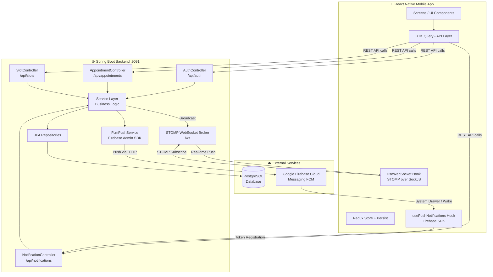
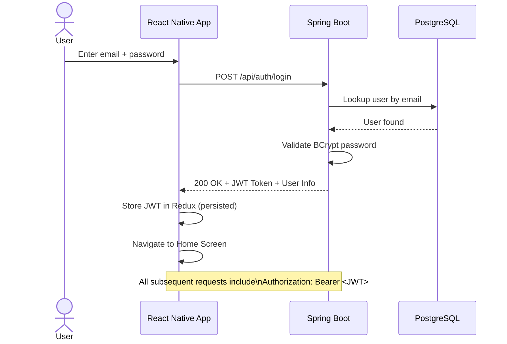
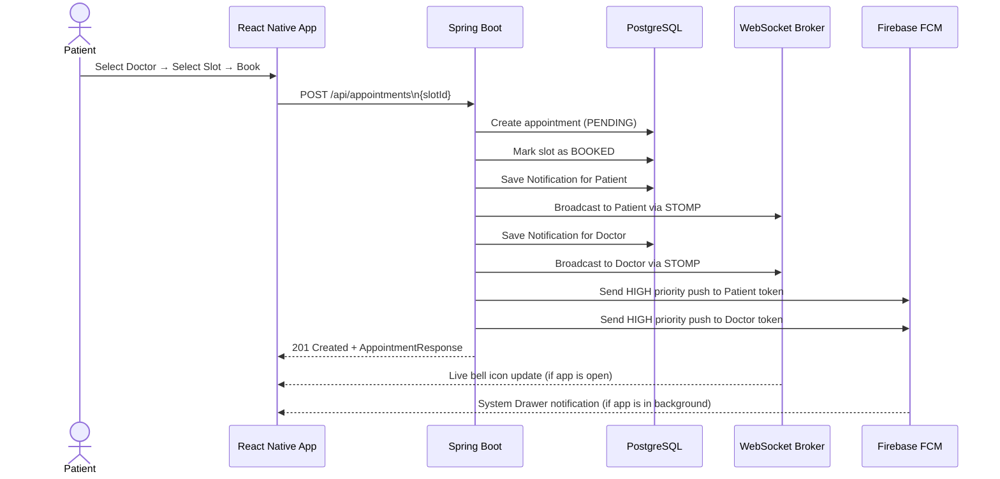
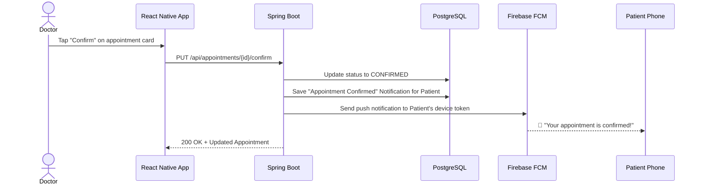
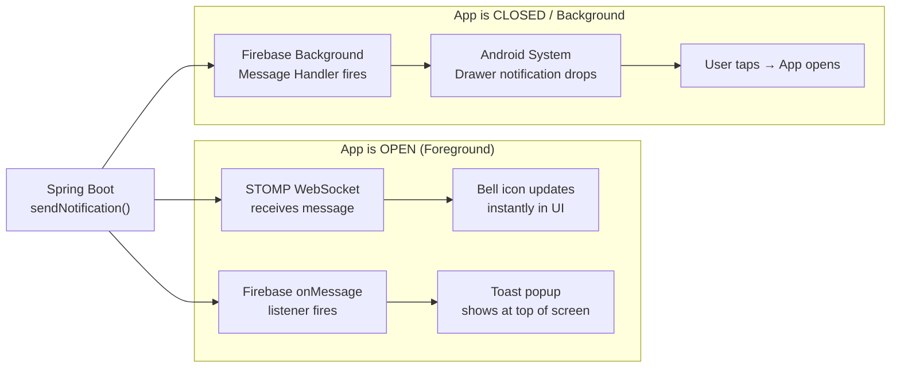
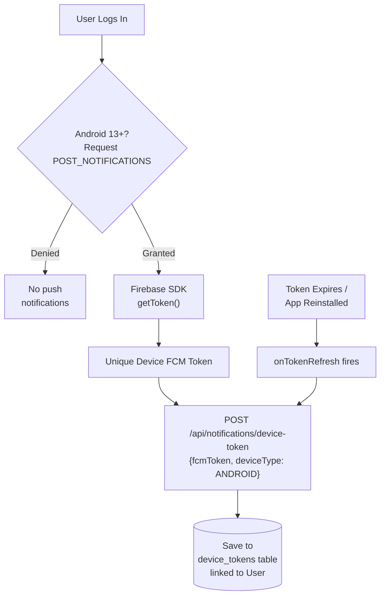

# MediBook — System Design

## 1. Overall Architecture

---

## 2. Authentication Flow

---

## 3. Appointment Booking Flow

---

## 4. Appointment Confirmation Flow (Doctor)

---

## 5. Real-Time Notification Flow

---

## 6. FCM Device Token Lifecycle

---

## 7. Tech Stack Summary

| Layer | Technology |
|---|---|
| **Mobile Frontend** | React Native + TypeScript |
| **State Management** | Redux Toolkit + RTK Query |
| **Persistence** | redux-persist (AsyncStorage) |
| **Navigation** | React Navigation v6 |
| **Real-Time (Foreground)** | STOMP over SockJS WebSocket |
| **Push Notifications** | Firebase Cloud Messaging (FCM) |
| **Backend Framework** | Spring Boot 3.5 (Java 17) |
| **Security** | Spring Security + JWT |
| **ORM** | Spring Data JPA + Hibernate |
| **Database** | PostgreSQL 14 |
| **Build Tool** | Maven |
